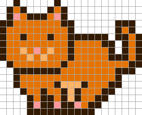
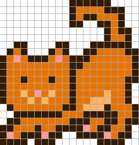
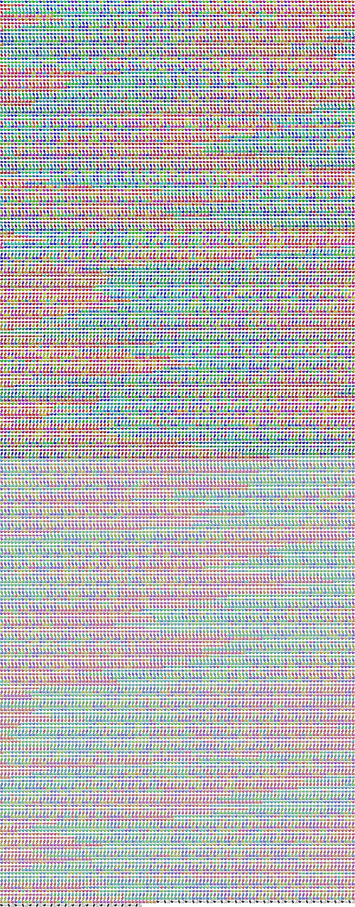

For more blockchain books, see the [**Best of Crypto Books page »**](https://openblockchains.github.io/crypto-books/)

---


> What is a mooncat? Just another cryptokitty? How are they selling for so much?
>
> Mooncats are scarce and verifiable.
> You can bring a mooncat anywhere in the world,
> airplane or boat, proving itself to be a truer store of value than gold itself.
>
> Only 25 thousand mooncats. 21 million bitcoins. Do the math.
>
> Oh my god I want so much a mooncat. How do I get a mooncat?
>
> Bought a mooncat!  Really happy to be a part of this historic moment.
> Poor things were stranded on the moon for 4 years.
>
> Bought my first mooncat, happy to have joined the club and I'm HODLing.
>
> Mooncat prices steadily rising ... people on the sidelines in disbelief.
>
> Spent over $20,000 on mooncat id 0xff0b000ca7 ... one of the first genesis batch.
>
> Changed my profile to a mooncat I bought.
>
> Mooncats just overtook hashmasks in 7 day volume ...
> less that 24 hours after the first sale ... crazy!
>
> Donated some mooncat profits to the local cat shelter,
> if you've made money off of digital cats please help some real cats too.
>
> Someone took Jeff Bezos crown today [as the richest man on earth].
> Top mooncat holder owns 1,144 cats. LOL.
>
> I can right click and save a mooncat [pixel image for free].
>
> Cryptocats hold more weight but hype is low
> because smaller amount of owners who are HODLling.
> So many more mooncat owners creating hype.
> Long term value is in cryptocats
> [only 625 cyrptocats. 25 thousand mooncats. Do the math.]
>
> -- March 13, 2021


<!--
  sources:
    https://twitter.com/krypticrooks/status/1370461081307611138
    https://twitter.com/sampepper/status/1370502291661287424
    https://twitter.com/HeadieXBT/status/1370790386592067587
    https://twitter.com/pwnlord69/status/1370480976309190656
    https://twitter.com/xenziiii/status/1370805874126643216
    https://twitter.com/EmyJColey/status/1370801384174583815
    https://twitter.com/shakiXBT/status/1370791104854036489
    https://twitter.com/YazTrades/status/1370760956259799040
    https://twitter.com/Fronta1pha/status/1370757584379068418
-->


# Awesome MoonCatRescue Bubble (Anno 2021)

25,600 MoonCats on the Blockchain - World's 1st On-Chain Generative Crypto Art - An Insanely Cute Rescue Operation


> MoonCatRescue is an exploration of user-discoverable blockchain assets.
> Users "mine" for MoonCats in their browser.
> After MoonCats are "mined", they can be put up for adoption, adoptions can be requested, they can be given away,
> and they can be permanently named.

Launched in August 2017 by Ponderware with 25,600 non-fungible tokens (NFTs) to rescue, pre the ERC721 standard.


Learn more @ [mooncatrescue.com](https://mooncatrescue.com),
twitter: [ponderware](https://twitter.com/ponderware),
reddit: [MoonCatRescue](https://www.reddit.com/r/MoonCatRescue/)


Note: Genesis cats (256 max.) are not "rescued" but rather "released" by the contract owners.
If those original project owners re-emerge, they'd have the ability to release more Genesis cats.


History

Mooncat Rescue Day - Friday, March 12, 2021 - Mooncat Mania

> Mooncats look like the 2nd oldest NFTs on Ethereum...
>
> How to claim for free?
>
> 1. Find Cats https://mooncatrescue.com/scan.html
> 2. Record seed and ID
> 3. https://etherscan.io/token/0x60cd862c9c687a9de49aecdc3a99b74a4fc54ab6#writeContract
> 4. Connect @MetaMask
> 5. RescueCat() enter seed
> 6. Pay Gas    [Should be like $35-50 else it is wrong.]
> HODL Your Mooncat

<!--
  https://twitter.com/RealAllenHena/status/1370404268604280832
 -->

2nd oldest digitial collectible¹ on the (ethereum)  blockchain
rediscovered after four years
and 100% rescued ("mined") during 4 hours of craze today.
The project died after a bug in the contract
that locked the raised fund mid 2017.

¹:
- CryptoPunks -
- MoonCats -       Aug 9, 2017
- CryptoKitties -  Nov 28, 2017


> MoonCatRescue has been added to the [Non-fungible Token Wikipedia page](https://en.wikipedia.org/wiki/Non-fungible_token).
> MoonCat is the 2nd NFT collection to ever exist on the Ethereum blockchain,
> it was only discovered 10 hours ago after being forgotten about for nearly 4 years.
>
> -- [March 12, 2021](https://twitter.com/HarryBTC/status/1370551833538785280)


Ponderware Update

twitter: [ponderware](https://twitter.com/ponderware)

First Update Since 2017!

>
> Attempting to re-establish contact with the moonbase. Stay Tuned.
>
> -- [March 13, 2021](https://twitter.com/ponderware/status/1370793182175318019)

Four Year Later on March 12th, 2021 MoonCatRescue Reborn!

> MoonCatRescue, an exploration of user-discoverable blockchain collectibles is now live.
> Come rescue a MoonCat at MoonCatRescue.com!
>
> -- [Aug 11, 2017](https://twitter.com/ponderware/status/896066883710926848)


MoonCats Facts

1. Founder unknown/disappeared. Just like Satoshi for #Bitcoin
2. Second oldest collectible on Ethereum after CryptoPunks
3. Only 25,600 in existence
4. Required CPU power and manual work -> No whales
5. Immense history value -> collectibles rescued after 4 years
6. CryptoKitties contract submitted on Nov 28, 2017, MoonCats contract submitted on Aug 09, 2017. This makes them first cats in NFT existence.
7. You can name them. And that was possible FOUR years before Hashmasks!


> -- [March 12, 2021](https://twitter.com/sampepper/status/1370502291661287424)


## Contracts

### /mooncats - MoonCatRescue

Etherscan

- MoonCatResuce, see contract address [`0x60cd862c9c687a9de49aecdc3a99b74a4fc54ab6`](https://etherscan.io/address/0x60cd862c9c687a9de49aecdc3a99b74a4fc54ab6#code)


For more see [**Inside the MoonCatRescue Blockchain Contract / Service »**](https://github.com/cryptocopycats/contracts/tree/master/mooncats)

### /mooncats-wrapped - MoonCatsWrapped - Wrapped MoonCatsRescue (WMCR)

> Wrapped MoonCats Rescue is an unofficial ERC721 wrapping of the MoonCats Rescue contract.

Etherscan

- MoonCatsWrapped - Wrapped MoonCatsRescue (WMCR), see contract address [`0x7c40c393dc0f283f318791d746d894ddd3693572`](https://etherscan.io/address/0x7c40c393dc0f283f318791d746d894ddd3693572#code)

For more see [**Inside the Wrapped MoonCatsRescue (WMCR) Blockchain Contract / Service »**](https://github.com/cryptocopycats/contracts/tree/master/mooncats-wrapped)


Markets

- Wrapped MoonCatsRescue (WMCR) @ OpenSea - [`wrapped-mooncatsrescue`](https://opensea.io/collection/wrapped-mooncatsrescue)


## Do-It-Yourself (DIY) Corner - The Original Mooncat Pixel Drawing Tool Online

The Mooncat developers (Ponderware) write:

> Here is the tool we wrote and used to generate the MoonCatRescue pixel art.
> There has been some interest in knowing how we drew them, so we figured we might as well release it.
> Prepare to be underwhelmed!  => [**mooncatrescue.com/pixeleditor**](https://mooncatrescue.com/pixeleditor)


A little tip if you try it out online - there are [128 original mooncat pixel drawings / designs](DESIGNS.md)
(all encoded in the original source code in a single-line string - see [`designs.rb`](https://raw.githubusercontent.com/cryptocopycats/mooncats/master/lib/mooncats/designs.rb) for a "word-wrapped" more readable
source of the original example.

Yes, you can read in the design into the pixel drawing tool online  (reformat required - every pixel row must be on its own line
and all (color) numbers space separated). Example for design 0:

```
0 0 0 1 1 1 1 1 1 0 0 0 0 0 0 0 0
0 1 1 1 3 3 3 3 3 1 0 0 0 0 0 0 0
1 3 5 3 3 3 3 3 3 3 1 1 1 0 0 0 0
0 1 3 3 3 1 3 4 3 3 1 3 3 1 0 0 0
0 0 1 3 3 3 3 3 4 3 1 3 3 3 1 1 1
0 0 1 3 3 3 3 5 3 3 1 3 3 3 3 5 1
0 0 1 3 3 3 3 3 4 3 1 3 3 1 1 1 1
0 1 3 3 3 1 3 4 3 3 1 3 3 3 1 1 1
1 3 5 3 3 3 3 3 3 3 1 3 1 3 3 5 1
0 1 1 1 3 3 3 3 3 1 3 3 4 1 1 1 1
0 0 0 1 1 1 1 1 1 3 3 3 4 4 4 1 1
0 0 0 0 0 1 3 3 3 3 3 3 4 1 1 5 1
0 0 0 0 0 1 3 3 3 3 3 3 1 3 3 3 1
0 0 0 0 0 1 3 3 3 3 3 3 3 3 3 1 1
0 0 0 0 0 1 3 3 3 3 3 3 3 3 1 1 0
0 0 0 0 0 1 1 3 3 3 3 3 3 1 1 0 0
0 0 0 0 0 0 1 1 1 3 3 3 1 1 0 0 0
0 0 0 1 1 1 0 0 1 3 1 1 1 0 0 0 0
0 0 0 1 3 1 1 1 1 3 1 0 0 0 0 0 0
0 0 0 1 1 3 3 3 3 1 1 0 0 0 0 0 0
0 0 0 0 0 1 1 1 1 1 0 0 0 0 0 0 0
```

Paste the text into the box below the pixel grid canvas and click on the read button.
Now you should see the mooncat pixel design.



And for some more fun here's the design 3 reformatted - ready to copy'n'paste:

```
0 0 0 0 0 0 0 0 1 1 1 1 1 1 1 0 0 0 1 1 1
0 0 0 0 0 0 0 1 3 3 3 3 3 3 3 1 0 1 1 5 1
0 0 0 0 0 0 1 3 5 3 3 3 3 3 3 3 1 1 3 3 1
0 0 0 0 0 0 1 1 3 3 3 1 3 4 3 3 1 3 3 1 1
0 0 0 0 0 0 0 0 1 3 3 3 3 3 4 3 1 3 3 1 0
0 0 0 0 0 0 0 0 1 3 3 3 3 5 3 3 1 3 1 1 1
0 0 0 0 0 0 0 0 1 3 3 3 3 3 4 3 1 3 3 5 1
0 0 0 0 0 0 0 1 3 3 3 1 3 4 3 3 1 3 3 1 1
0 0 0 0 0 0 1 3 5 3 3 3 3 3 3 3 1 3 1 1 0
0 0 0 0 0 0 1 1 3 3 3 3 3 3 3 1 3 3 1 0 0
1 1 1 1 0 0 0 0 1 1 1 1 1 1 1 1 3 1 1 0 0
1 3 3 1 0 0 0 0 1 1 3 3 3 3 3 3 3 1 1 1 0
1 3 1 0 0 0 0 1 1 3 3 3 3 3 3 4 1 1 5 1 0
1 3 1 0 0 0 1 1 3 3 3 3 3 3 4 4 1 3 3 1 0
1 3 3 1 0 0 1 3 3 3 3 3 3 3 4 4 1 3 1 1 1
1 1 3 1 1 1 1 3 3 3 3 3 3 4 4 1 1 1 1 5 1
0 1 3 3 3 3 1 3 3 3 3 3 3 3 3 3 1 1 3 3 1
0 1 1 1 1 3 1 3 3 3 3 3 3 3 3 3 3 3 3 1 1
0 0 0 0 1 1 1 1 3 3 3 1 1 1 1 3 3 1 1 1 0
0 0 0 0 0 0 0 1 1 1 1 1 0 0 0 1 1 1 0 0 0
```




## Datasets

### mooncats.csv  -  25 440 MoonCats by ID with Pattern, Pose, Facing, Face, Fur and Colors in RGB and HSL (Hue, Sat, Lum)

Mooncats dataset in comma-separated values (CSV) format
in blocks of a thousand cats each
(e.g.
`00.csv` incl. 0x0000020886-0x000a05b9ac,
`01.csv` incl. 0x000a0a11c8-0x0013b68a2f,
`02.csv` incl. 0x0013b72770-0x001e26e929,
and so on).
The data records for cats
incl. id, palette, pattern, pose, facing, face, fur, colors in rbg and hsl (hue, sat, lum), row and mint serial number,
and more.
Example - `00.csv`:


```
row, id,           palette, pattern, pose, facing, face, fur, color,    ... mint
0,   0x0000020886, Normal, 0, Standing, Left, Smile, Solid, Sky Blue,   ... 2679
1,   0x000002f63e, Normal, 0, Standing, Left, Smile, Solid, Green,      ... 13869
2,   0x000004683b, Normal, 0, Standing, Left, Smile, Solid, Lime Green, ... 24457
3,   0x0000048998, Normal, 0, Standing, Left, Smile, Solid, Cyan,       ... 22386
4,   0x000006ce5d, Normal, 0, Standing, Left, Smile, Solid, Green,      ... 7933
...
```


For more see [**/mooncatrescue »**](https://github.com/cryptocopycats/mooncatrescue)


## mooncatrescue.png Composite - All 25 440 MoonCats in One Image (2400×6120)



You can download all 25 440 MoonCats
in a 2400×6120 image (~ 6 MB) for free.
See [`mooncatrescue.png` »](i/mooncatrescue.png).

Note: The listing follows the mooncats.csv dataset, that is,
ordered by ids
e.g. `0x0000020886`, `0x000002f63e`, `0x000004683b`,
and so on.
