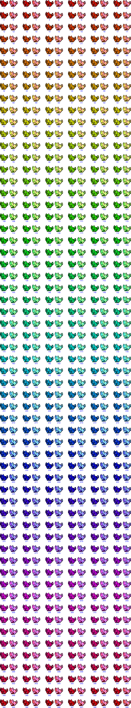

# Images

All Pose / Pattern Variations

Source: <https://old.reddit.com/r/MoonCatRescue/comments/6tmp86/all_possible_mooncat_patterns/>

All Color Variations

Source: <https://old.reddit.com/r/MoonCatRescue/comments/6tmu09/all_color_variations_for_mooncats/>

Visual of the Hue-based color wheel; how MoonCats are colorized

Source: <https://old.reddit.com/r/MoonCatRescue/comments/m4h7lx/visual_of_the_huebased_color_whee_how_mooncats/>

MoonCat "K" values explained

Source: <https://old.reddit.com/r/MoonCatRescue/comments/m4gazs/mooncat_k_values_explained/>

